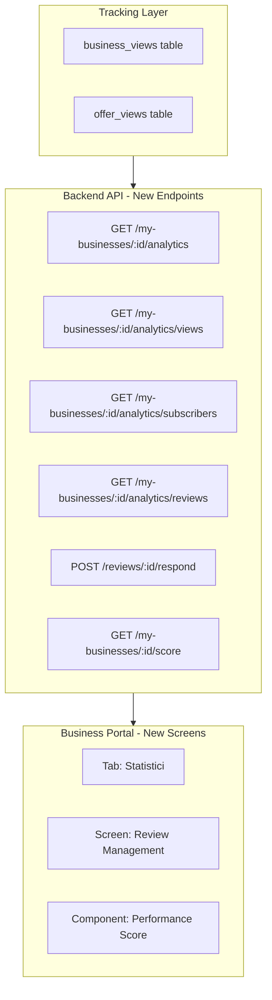
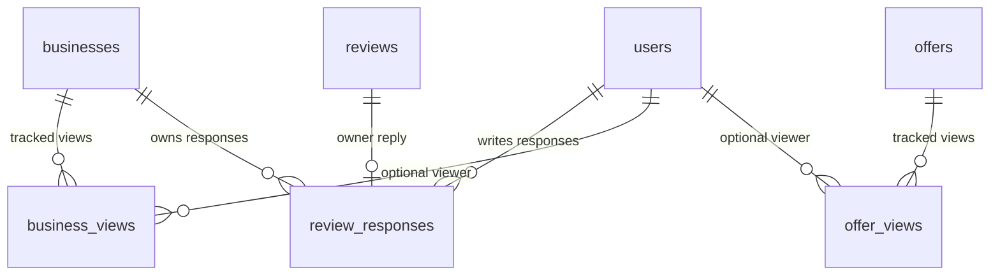

# Business Portal Pro - Analytics, Reviews, Performance Score

## Arhitectura generala

Totul se construieste in stack-ul existent: backend Node.js/Express + frontend Expo (care ruleaza si pe web). Nu este nevoie de un dashboard web separat — Expo ruleaza cross-platform, iar layout-ul va fi responsive (mai multe date pe ecran mare).




---

## Faza 1: Tracking Infrastructure (backend)

### 1.1 Tabele noi in PostgreSQL

`**business_views**` — cine vizualizeaza pagina unui business:

```sql
CREATE TABLE business_views (
    id SERIAL PRIMARY KEY,
    business_id INTEGER NOT NULL REFERENCES businesses(id) ON DELETE CASCADE,
    user_id INTEGER REFERENCES users(id) ON DELETE SET NULL,
    viewed_at TIMESTAMP WITH TIME ZONE DEFAULT CURRENT_TIMESTAMP,
    source VARCHAR(20) DEFAULT 'app'  -- 'app', 'web', 'share'
);
CREATE INDEX idx_bv_business_date ON business_views(business_id, viewed_at);
```

`**offer_views**` — cine vizualizeaza o oferta:

```sql
CREATE TABLE offer_views (
    id SERIAL PRIMARY KEY,
    offer_id INTEGER NOT NULL REFERENCES offers(id) ON DELETE CASCADE,
    user_id INTEGER REFERENCES users(id) ON DELETE SET NULL,
    viewed_at TIMESTAMP WITH TIME ZONE DEFAULT CURRENT_TIMESTAMP
);
CREATE INDEX idx_ov_offer_date ON offer_views(offer_id, viewed_at);
```

`**review_responses**` — raspunsuri de la business owners la recenzii:

```sql
CREATE TABLE review_responses (
    id SERIAL PRIMARY KEY,
    review_id INTEGER NOT NULL UNIQUE REFERENCES reviews(id) ON DELETE CASCADE,
    business_id INTEGER NOT NULL REFERENCES businesses(id) ON DELETE CASCADE,
    user_id INTEGER NOT NULL REFERENCES users(id),
    response_text TEXT NOT NULL,
    created_at TIMESTAMP WITH TIME ZONE DEFAULT CURRENT_TIMESTAMP,
    updated_at TIMESTAMP WITH TIME ZONE DEFAULT CURRENT_TIMESTAMP
);
```

### 1.2 Tracking in endpoint-urile existente

Modificam 2 endpoint-uri existente sa inregistreze vizualizari:

- [businesses.js](appredueri_backend/src/routes/businesses.js): `GET /businesses/:id` — insert in `business_views`
- [offers.js](appredueri_backend/src/routes/offers.js): `GET /offers/:id` — insert in `offer_views`

Tracking-ul va fi **fire-and-forget** (nu blocheaza response-ul):

```javascript
// Non-blocking tracking
pool.query('INSERT INTO business_views (business_id, user_id) VALUES ($1, $2)', 
    [id, req.user?.id || null]).catch(() => {});
```

---

## Faza 2: Analytics API (backend)

Endpoint-uri noi in [business-portal.js](appredueri_backend/src/routes/business-portal.js):

### `GET /my-businesses/:id/analytics`

Returneaza overview complet:

- **Views**: total, ultimele 7 zile, ultimele 30 zile, trend (% vs perioada anterioara)
- **Subscribers**: total followeri, noi in ultimele 7/30 zile, trend
- **Reviews**: total, rating mediu, distributie (1-5 stele), noi in ultimele 30 zile
- **Offers**: numar active, total views per oferta, total favorites per oferta
- **Performance Score**: scor calculat (detalii la Faza 4)

### `GET /my-businesses/:id/analytics/views?period=7d|30d|90d`

Returneaza date pe zile pentru grafic:

```json
{ "data": [{ "date": "2026-02-01", "views": 23 }, ...] }
```

### `GET /my-businesses/:id/analytics/subscribers?period=30d`

Returneaza trend subscriberi pe zile:

```json
{ "data": [{ "date": "2026-02-01", "new": 3, "total": 45 }, ...] }
```

---

## Faza 3: Review Management (backend + frontend)

### Backend - endpoint-uri noi:

- `**GET /my-businesses/:id/reviews**` — toate recenziile cu status raspuns (da/nu), sortare, filtrare
- `**POST /my-businesses/:id/reviews/:reviewId/respond**` — raspunde la o recenzie (max 500 chars, un raspuns per review)
- `**PUT /my-businesses/:id/reviews/:reviewId/respond**` — editeaza raspunsul
- `**DELETE /my-businesses/:id/reviews/:reviewId/respond**` — sterge raspunsul

### Frontend:

**Screen noua: Review Management** ([business-portal/[id]/reviews.tsx])

- Lista toate recenziile cu: user, rating (stele), comentariu, data
- Buton "Raspunde" per review (expandable text input)
- Raspunsul afisat sub review cu label "Raspuns de la business"
- Badge cu numar de reviews fara raspuns
- Filtrare: toate / fara raspuns / cu raspuns / per rating

**Afisare raspunsuri pe pagina publica** ([business/[id].tsx]):

- Sub fiecare review, daca exista raspuns, arata: "Raspuns de la [business_name]: ..."

---

## Faza 4: Performance Score (backend + frontend)

### Calculare scor (0-100):


| Criteriu                  | Puncte max | Logica                     |
| ------------------------- | ---------- | -------------------------- |
| Logo uploadat             | 10         | logo_url != null           |
| Cover uploadat            | 5          | cover_image_url != null    |
| Galerie (3+ imagini)      | 10         | business_images count >= 3 |
| Telefon completat         | 5          | phone != null              |
| Website completat         | 5          | website != null            |
| Booking configurat        | 10         | booking_type != 'none'     |
| Cel putin 1 oferta activa | 15         | active offers > 0          |
| Rating >= 4.0             | 10         | avg rating >= 4.0          |
| 5+ recenzii               | 10         | review count >= 5          |
| Raspuns la 80%+ reviews   | 10         | responded / total >= 0.8   |
| 10+ subscriberi           | 10         | followers >= 10            |


### Backend: `GET /my-businesses/:id/score`

Returneaza:

```json
{
  "score": 75,
  "breakdown": [
    { "criterion": "Logo", "points": 10, "max": 10, "completed": true },
    { "criterion": "Website", "points": 0, "max": 5, "completed": false, "tip": "Adauga un website pentru a creste vizibilitatea" }
  ],
  "tips": ["Adauga un website", "Raspunde la recenzii"]
}
```

### Frontend: Performance Score Card

- Cerc animat cu scorul (0-100) - culoare verde/galben/rosu
- Lista de criterii cu check/X
- Tips actionable ("Adauga o imagine cover" -> navigheaza direct la tab Images)

---

## Faza 5: Analytics Dashboard UI (frontend mobile + web)

### Tab nou "Statistici" in Business Portal

Adaugam un al 5-lea tab in [business-portal/[id]/index.tsx](appredueri_mobile/app/business-portal/[id]/index.tsx):
**Info | Imagini | Oferte | Recenzii | Statistici**

(Tab-ul "Recenzii" este nou — Review Management. "Preview" se muta in header ca buton.)

### Ecranul Statistici contine:

1. **Performance Score Card** (in top) — cercul cu scor + tips
2. **Quick Stats Row** — 4 carduri: Views (30d), Subscriberi, Rating, Oferte active
3. **Views Chart** — grafic pe ultimele 30 zile (bare sau linie)
4. **Subscriber Trend** — grafic cu cresterea
5. **Rating Distribution** — bare orizontale (5 stele -> 1 stea, cu procentaje)
6. **Top Oferte** — top 3 oferte dupa views/favorites

### Responsive layout:

- **Mobile**: carduri stacked vertical, grafice full-width
- **Web (desktop)**: grid 2 coloane, grafice side-by-side, mai multe date vizibile

### Librarie grafice:

- `**react-native-chart-kit**` — functioneaza pe mobile + web, suficient pentru grafice simple (line chart, bar chart)

---

## Tabele DB noi (rezumat):




---

## Fisiere noi/modificate:

**Backend:**

- `migrations/create_views_tracking.sql` — tabele business_views, offer_views
- `migrations/create_review_responses.sql` — tabel review_responses
- `src/routes/business-portal.js` — +6 endpoint-uri noi (analytics, reviews, score)
- `src/routes/businesses.js` — +tracking views
- `src/routes/offers.js` — +tracking views
- `src/routes/reviews.js` — include review_responses in output

**Frontend:**

- `app/business-portal/[id]/index.tsx` — tab-uri noi (Statistici, Recenzii)
- `app/business-portal/[id]/reviews.tsx` — NOU: review management screen
- `components/PerformanceScore.tsx` — NOU: cerc animat cu scor
- `components/StatsCard.tsx` — NOU: card cu metrica + trend
- `components/SimpleChart.tsx` — NOU: wrapper chart-kit
- `components/RatingDistribution.tsx` — NOU: bare distributie rating
- `components/ReviewResponseCard.tsx` — NOU: review cu raspuns
- `app/business/[id].tsx` — afisare raspunsuri la reviews

**Dependente noi:**

- `react-native-chart-kit` + `react-native-svg` (grafice)

---

## Ordine implementare recomandata:

1. **Tracking** (Faza 1) — fara tracking nu avem date; se instaleaza primul
2. **Analytics API** (Faza 2) — endpoint-urile backend
3. **Performance Score** (Faza 4) — nu depinde de tracking (foloseste date existente)
4. **Review Management** (Faza 3) — raspunsuri la reviews
5. **Dashboard UI** (Faza 5) — ecranele frontend care leaga totul

Estimare effort: ~3-4 sesiuni de lucru.